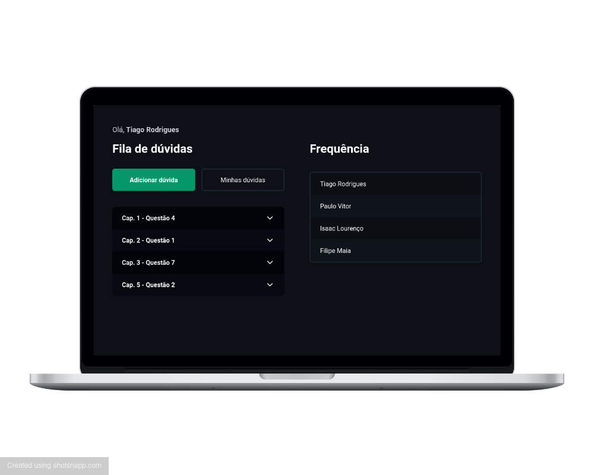

## Monitorey




> Projeto com intuito de ajudar nas monitorias da matéria de Matemática Elementar na UFRN.

## 🛠️ Tecnologias

<div style="display: inline_block"><br>
    
    
    
    
</div><br>

### Docs

- [React](https://pt-br.reactjs.org/)
- [NextJs](https://nextjs.org/)
- [SocketIO](https://socket.io/)
- [Tailwindcss](https://tailwindcss.com/)

## 🚀 Instalando

1. Clone este repositório:
    ```
        $ git clone https://github.com/PauloVLB/monitorey.git
    ```
2. Vá para o projeto:
    ```
    $ cd monitorey
    ```
3. Instale as dependências:
   1. NPM:
   ```
   $ npm i
   ```
4. Ligue o server
    ```
    $ npm run dev
    ```
5. Acesse em [http:localhost:3000](http:localhost:3000)

## 🤝 Colaboradores

Agradecemos às seguintes pessoas que contribuíram para este projeto:

<table>
  <tr>
    <td align="center">
      <a href="https://github.com/PauloVLB">
        <br>
        <sub>
          <b>Paulo Vitor</b>
        </sub>
      </a>
    </td>
    <td align="center">
      <a href="https://github.com/isaacmsl">
        <br>
        <sub>
          <b>Isaac Lourenço</b>
        </sub>
      </a>
    </td>
    <td align="center">
      <a href="https://github.com/tiago-rodrigues1">
        <br>
        <sub>
          <b>Tiago Rodrigues</b>
        </sub>
      </a>
    </td>
  </tr>
</table>
